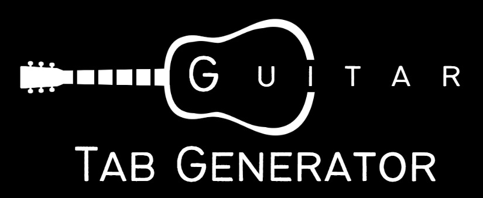

# Guitar Tab Generator

[](https://github.com/noahbaculi/guitar-tab-generator/actions/workflows/rust_build_and_test.yml)
[](https://codecov.io/gh/noahbaculi/guitar-tab-generator)



Generate fingerstyle guitar tabs from note names and account for the difficulty
of different finger positions. Built with Rust. Designed for compilation to
WebAssembly for use in web applications.

[][https://www.rust-lang.org/]

[https://webassembly.org/]

## Table of Contents

- [Guitar Tab Generator](#guitar-tab-generator)
  - [Table of Contents](#table-of-contents)
  - [Demo](#demo)
  - [Features](#features)
  - [Pathfinding Visualization](#pathfinding-visualization)
  - [Previous versions](#previous-versions)
  - [Contributing and Installation](#contributing-and-installation)
    - [Build from source](#build-from-source)
    - [Run examples](#run-examples)
    - [Background code runner](#background-code-runner)
    - [Calculate code coverage](#calculate-code-coverage)
    - [Screen for potentially unused feature flags](#screen-for-potentially-unused-feature-flags)
    - [Build WASM binary](#build-wasm-binary)
  - [Future Improvements](#future-improvements)

## Demo

[Example web application 🚀](https://noahbaculi.com/guitartab)

IMAGE

## Features

- Input pitch parsing
- Alternate tunings
- Capo consideration
- Any number of strings (not just 6 string guitars!)
- Configurable number of frets
- Tab width and padding formatting
- Playback indicator for playback applications

## Pathfinding Visualization

The pathfinding calculation is initiated by the
`Arrangement::create_arrangements()` function.

## Previous versions

- [Typescript](https://github.com/noahbaculi/guitar-tab-generator_typescript) (2022)
- [Java](https://github.com/noahbaculi/guitar-tab-generator_java) (2019 - 2022)

## Contributing and Installation

### Build from source

Requires:

- The [Rust toolchain](https://www.rust-lang.org/tools/install)
- The [Git version control system](https://git-scm.com/)

```shell
git clone https://github.com/noahbaculi/guitar-tab-generator.git
cd guitar-tab-generator
```

### Run examples

```shell
cargo run --example basic
cargo run --example advanced
```

### Background code runner

```shell
bacon
```

### Calculate code coverage

```shell
cargo tarpaulin --out Html --output-dir dev/tarpaulin-coverage
```

### Screen for potentially unused feature flags

```shell
unused-features analyze --report-dir 'dev/unused-features-report'
unused-features build-report --input 'dev/unused-features-report/report.json'
```

### Build WASM binary

```shell
wasm-pack build --target web --out-dir pkg/wasm_guitar_tab_generator

# check binary size
ls -l pkg/wasm_guitar_tab_generator/guitar_tab_generator_bg.wasm
```

## Future Improvements

- [ ] Borrowed types vs box vs RC
- [ ] Parallelism with [Rayon](https://docs.rs/rayon/latest/rayon/#how-to-use-rayon)
- [ ] Add filter for max_fret_span in `arrangements`
- [ ] Audit namespace of functions (object functions vs standalone) (public vs private)
- [ ] Property testing with [Proptest](https://altsysrq.github.io/proptest-book/)
