# Guitar Tab Generator

[](https://github.com/noahbaculi/guitar-tab-generator/actions/workflows/rust_build_and_test.yml)
[](https://codecov.io/gh/noahbaculi/guitar-tab-generator)


Generate fingerstyle guitar tabs based on the difficulty of different finger positions. Built with Rust. Designed for compilation to WebAssembly for use in web applications.

[][wasm_site]
[][rust_site]

<br />

## Table of Contents

- [Guitar Tab Generator](#guitar-tab-generator)
  - [Table of Contents](#table-of-contents)
  - [Demo](#demo)
  - [Features](#features)
  - [Previous versions](#previous-versions)
  - [Pathfinding Algorithm Visualization](#pathfinding-algorithm-visualization)
    - [Pitch Fingerings](#pitch-fingerings)
      - [Beat 1 pitch fingerings](#beat-1-pitch-fingerings)
      - [_Beat 2 is a rest and therefore has no fingerings._](#beat-2-is-a-rest-and-therefore-has-no-fingerings)
      - [Beat 3 pitch fingerings](#beat-3-pitch-fingerings)
      - [Beat 4 pitch fingerings](#beat-4-pitch-fingerings)
    - [Fingering combinations for each beat](#fingering-combinations-for-each-beat)
      - [Beat 4 fingering combinations](#beat-4-fingering-combinations)
    - [Pathfinding nodes](#pathfinding-nodes)
    - [Algorithm choice](#algorithm-choice)
  - [Contributing and Installation](#contributing-and-installation)
    - [Build from source](#build-from-source)
    - [Run examples](#run-examples)
    - [Background code runner](#background-code-runner)
    - [Calculate code coverage](#calculate-code-coverage)
    - [Screen for potentially unused feature flags](#screen-for-potentially-unused-feature-flags)
    - [Build WASM binary](#build-wasm-binary)
  - [Future Improvements](#future-improvements)

## Demo

[Example web application 🚀](https://noahbaculi.com/guitartab)


## Features

- Input pitch parsing
- Alternate tunings
- Capo consideration
- Any number of strings (not just 6 string guitars!)
- Configurable number of frets
- Tab width and padding formatting
- Playback indicator for playback applications
- Pathfinding algorithm leverage Dijkstra's algorithm to calculate the arrangement with the least difficulty.

## Previous versions

This project has been attempted numerous times with varying levels of success. This attempt utilizes Rust and WASM to overcome the previously-encountered roadblocks regarding performance, distribution, and developer ergonomics.

- [Typescript version](https://github.com/noahbaculi/guitar-tab-generator_typescript) (2022)
- [Java version](https://github.com/noahbaculi/guitar-tab-generator_java) (2019 - 2022)

## Pathfinding Algorithm Visualization

The pathfinding calculation is initiated by the `Arrangement::create_arrangements()` function.

Let's look at an example with a standard guitar where we want to find the optimal arrangement to play a G3, then a rest, then a B3, then a D4 and G4 simultaneously. The pitch input for this example could look like this:

```text
G3

B3
D4G4
```

### Pitch Fingerings

The different fingerings are then calculated for each pitch. For example, a G3 can be played on string 3 at fret 0, or string 4 at fret 5, and so on:

#### Beat 1 pitch fingerings

| Representation | String | Fret |
| :------------- | :----: | :--: |
| G3 : 3 ⇒ 0     |   3    |  0   |
| G3 : 4 ⇒ 5     |   4    |  5   |
| G3 : 5 ⇒ 10    |   5    |  10  |
| G3 : 6 ⇒ 15    |   6    |  15  |

#### _Beat 2 is a rest and therefore has no fingerings._

#### Beat 3 pitch fingerings

| Representation | String | Fret |
| :------------- | :----: | :--: |
| B3 : 2 ⇒ 0     |   2    |  0   |
| B3 : 3 ⇒ 4     |   3    |  4   |
| B3 : 4 ⇒ 9     |   4    |  9   |
| B3 : 5 ⇒ 14    |   5    |  14  |

#### Beat 4 pitch fingerings

| Representation | String | Fret |     | Representation | String | Fret |
| :------------- | :----: | :--: | --- | :------------- | :----: | :--: |
| D4 : 2 ⇒ 3     |   2    |  3   |     | G4 : 1 ⇒ 3     |   1    |  3   |
| D4 : 3 ⇒ 7     |   3    |  7   |     | G4 : 2 ⇒ 8     |   2    |  8   |
| D4 : 4 ⇒ 12    |   4    |  12  |     | G4 : 3 ⇒ 12    |   3    |  12  |
| D4 : 5 ⇒ 17    |   5    |  17  |     | G4 : 4 ⇒ 17    |   4    |  17  |

### Fingering combinations for each beat

For beat 1 and beat 3, the fingering combinations identical to the pitch fingerings since those beats only play one pitch each. For beat 4, we calculate the [cartesian product](https://en.wikipedia.org/wiki/Cartesian_product) of the pitch fingerings to consider all of the fingerings combinations.

#### Beat 4 fingering combinations

| D4 Fingering    |     | G4 Fingering    |
| :-------------- | --- | :-------------- |
| D4 : 2 ⇒ 3      |     | G4 : 1 ⇒ 3      |
| ~~D4 : 2 ⇒ 3~~  |     | ~~G4 : 2 ⇒ 8~~  |
| D4 : 2 ⇒ 3      |     | G4 : 3 ⇒ 12     |
| D4 : 2 ⇒ 3      |     | G4 : 4 ⇒ 17     |
| D4 : 3 ⇒ 7      |     | G4 : 1 ⇒ 3      |
| D4 : 3 ⇒ 7      |     | G4 : 2 ⇒ 8      |
| ~~D4 : 3 ⇒ 7~~  |     | ~~G4 : 3 ⇒ 12~~ |
| D4 : 3 ⇒ 7      |     | G4 : 4 ⇒ 17     |
| D4 : 4 ⇒ 12     |     | G4 : 1 ⇒ 3      |
| D4 : 4 ⇒ 12     |     | G4 : 2 ⇒ 8      |
| D4 : 4 ⇒ 12     |     | G4 : 3 ⇒ 12     |
| ~~D4 : 4 ⇒ 12~~ |     | ~~G4 : 4 ⇒ 17~~ |
| D4 : 5 ⇒ 17     |     | G4 : 1 ⇒ 3      |
| D4 : 5 ⇒ 17     |     | G4 : 2 ⇒ 8      |
| D4 : 5 ⇒ 17     |     | G4 : 3 ⇒ 12     |
| D4 : 5 ⇒ 17     |     | G4 : 4 ⇒ 17     |

> Note: `D4 : 2 ⇒ 3` with `G4 : 1 ⇒ 3` is valid; while `D4 : 2 ⇒ 3` with `G4 : 2 ⇒ 8` is invalid since multiple frets cannot be played on the same string.

### Pathfinding nodes

To calculate the optimal set of fingering combinations of each beat, we construct a node for each fingering combination. The node contains underlying data that informs the calculation of the difficulty of progressing from one fingering combination to another including

- the average non-zero fret value
- the non-zero fret span

Additionally, each node must be unique so the beat index is included in the underlying data of the node.

```mermaid
flowchart TB
    subgraph Beat1
    direction TB
        1.1("G3 : 3 ⇒ 0")
        1.2("G3 : 4 ⇒ 5")
        1.3("G3 : 5 ⇒ 10")
        1.4("G3 : 6 ⇒ 15")
    end

    subgraph Beat2
    direction TB
        2.1("Rest")
    end

    subgraph Beat3
    direction TB
        3.1("B3 : 2 ⇒ 0")
        3.2("B3 : 3 ⇒ 4")
        3.3("B3 : 4 ⇒ 9")
        3.4("B3 : 5 ⇒ 14")
    end

    subgraph Beat4
    direction TB
        4.1("D4 : 2 ⇒ 3 \nG4 : 1 ⇒ 3")
        4.2("D4 : 2 ⇒ 3 \nG4 : 3 ⇒ 12")
        4.3("D4 : 2 ⇒ 3 \nG4 : 4 ⇒ 17")
        4.4("D4 : 3 ⇒ 7 \nG4 : 1 ⇒ 3")
        4.5("D4 : 3 ⇒ 7 \nG4 : 2 ⇒ 8")
        4.6("D4 : 3 ⇒ 7 \nG4 : 4 ⇒ 17")
        4.7("D4 : 4 ⇒ 12\nG4 : 1 ⇒ 3")
        4.8("D4 : 4 ⇒ 12\nG4 : 2 ⇒ 8")
        4.9("D4 : 4 ⇒ 12\nG4 : 3 ⇒ 12")
        4.10("D4 : 5 ⇒ 17\nG4 : 1 ⇒ 3")
        4.11("D4 : 5 ⇒ 17\nG4 : 2 ⇒ 8")
        4.12("D4 : 5 ⇒ 17\nG4 : 3 ⇒ 12")
        4.13("D4 : 5 ⇒ 17\nG4 : 4 ⇒ 17")
    end

    Beat1 ~~~ Beat2 ~~~ Beat3 ~~~ Beat4
```



With the node edges, we can see the directed graph take shape:

```mermaid
%%{ init: { 'flowchart': { 'curve': 'basis' } } }%%
flowchart TB
    subgraph Beat1
    direction TB
        1.1("G3 : 3 ⇒ 0")
        1.2("G3 : 4 ⇒ 5")
        1.3("G3 : 5 ⇒ 10")
        1.4("G3 : 6 ⇒ 15")
    end

    1.1 & 1.2 & 1.3 & 1.4 --> 2.1

    subgraph Beat2
    direction TB
        2.1("Rest")
    end

    2.1 --> 3.1 & 3.2 & 3.3 & 3.4

    subgraph Beat3
    direction TB
        3.1("B3 : 2 ⇒ 0")
        3.2("B3 : 3 ⇒ 4")
        3.3("B3 : 4 ⇒ 9")
        3.4("B3 : 5 ⇒ 14")
    end

    3.1 & 3.2 & 3.3 & 3.4 --> 4.1 & 4.2 & 4.3 & 4.4 & 4.5 & 4.6 & 4.7 & 4.8 & 4.9 & 4.10 & 4.11 & 4.12 & 4.13

    subgraph Beat4
    direction TB
        4.1("D4 : 2 ⇒ 3 \nG4 : 1 ⇒ 3")
        4.2("D4 : 2 ⇒ 3 \nG4 : 3 ⇒ 12")
        4.3("D4 : 2 ⇒ 3 \nG4 : 4 ⇒ 17")
        4.4("D4 : 3 ⇒ 7 \nG4 : 1 ⇒ 3")
        4.5("D4 : 3 ⇒ 7 \nG4 : 2 ⇒ 8")
        4.6("D4 : 3 ⇒ 7 \nG4 : 4 ⇒ 17")
        4.7("D4 : 4 ⇒ 12\nG4 : 1 ⇒ 3")
        4.8("D4 : 4 ⇒ 12\nG4 : 2 ⇒ 8")
        4.9("D4 : 4 ⇒ 12\nG4 : 3 ⇒ 12")
        4.10("D4 : 5 ⇒ 17\nG4 : 1 ⇒ 3")
        4.11("D4 : 5 ⇒ 17\nG4 : 2 ⇒ 8")
        4.12("D4 : 5 ⇒ 17\nG4 : 3 ⇒ 12")
        4.13("D4 : 5 ⇒ 17\nG4 : 4 ⇒ 17")
    end

    Beat1 ~~~ Beat2 ~~~ Beat3 ~~~ Beat4
```



### Algorithm choice

The number of fingering combinations grows exponentially with more beats and pitches so the choice of [shortest path algorithm](https://en.wikipedia.org/wiki/Shortest_path_problem) is critical. The [Dijkstra](https://en.wikipedia.org/wiki/Dijkstra%27s_algorithm) pathfinding algorithm was chosen for this application of the "shortest path exercise" for the following reasons:

- The sequential nature of the musical arrangement problem results in a _directed_ graph where only nodes representing consecutive beat fingering combinations have edges.
- The edges between nodes are _weighted_ with the difficulty of moving from one fingering combination to another graph above is already constructed with the only possible next nodes connected.

## Contributing and Installation

### Build from source

Requires:

- The [Rust toolchain](https://www.rust-lang.org/tools/install)
- The [Git version control system](https://git-scm.com/)

```shell
git clone https://github.com/noahbaculi/guitar-tab-generator.git
cd guitar-tab-generator
```

### Run examples

```shell
cargo run --example basic
cargo run --example advanced
```

### Background code runner

```shell
bacon
```

### Calculate code coverage

```shell
cargo tarpaulin --out Html --output-dir dev/tarpaulin-coverage
```

### Screen for potentially unused feature flags

```shell
unused-features analyze --report-dir 'dev/unused-features-report'
unused-features build-report --input 'dev/unused-features-report/report.json'
```

### Build WASM binary

```shell
wasm-pack build --target web --out-dir pkg/wasm_guitar_tab_generator

# check binary size
ls -l pkg/wasm_guitar_tab_generator/guitar_tab_generator_bg.wasm
```

## Future Improvements

- [ ] Borrowed types vs box vs RC
- [ ] Parallelism with [Rayon](https://docs.rs/rayon/latest/rayon/#how-to-use-rayon)
- [ ] Add filter for max_fret_span in `arrangements`
- [ ] Audit namespace of functions (object functions vs standalone) (public vs private)
- [ ] Property testing with [Proptest](https://altsysrq.github.io/proptest-book/)

[rust_site]: https://www.rust-lang.org/
[wasm_site]: https://webassembly.org/
